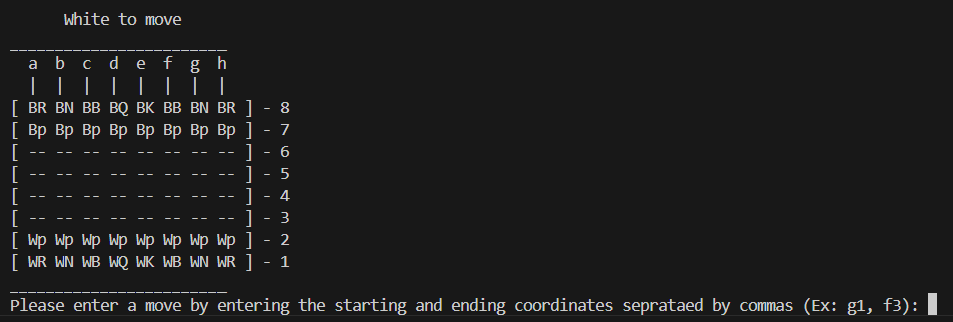
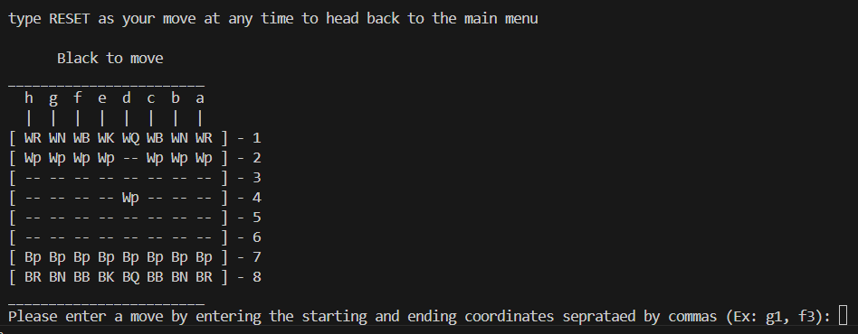

# FianchettoPy

A GUI Chess board that enforces all of the rules of chess.

## Installation

Use the package manager [pip](https://pip.pypa.io/en/stable/) and github to install FianchettoPy.
We recommend using a virtual environment to avoid package conflicts:

### For Mac/Linux

```bash
python -m venv venv
source venv/bin/activate
```

### For Windows

```powershell
venv\Scripts\activate
```

### Install directly from GitHub

```bash
pip install git+https://github.com/AgoCodeBro/FianchettoPy.git
```

## Usage

### After installation, run the game with:

`fianchetto`

If you installed FianchettoPy using the venv, ensure that it is active when you run the command

Once the game launches, type `Y` to start and you should be presented with the board



*FianchettoPy game displaying the board from whites point of view*

Here you can make a move by typing the square of the piece you want to move, followed by the square 
the piece would end up on, separated by a comma. For example to move your pawn to d4 you would input:

`d2, d4`

This would play the move and display the board from blacks perspective



At anytime during a game, you can input `RESET` and head back to the startting menu

## Features

- All types of pieces implemented and enforces their proper move set
- Full CLI
- Board flips bewtween moves
- En Passant

## Status

Project is at v0.3.0

## Roadmap

- [x] Project Setup
- [x] Board Representation
- [x] Piece Logic
- [x] Board Manager
- [ ] Full Rules
    - [ ] Castling
    - [ ] Promotion
    - [ ] Checks
    - [ ] Checkmate
    - [ ] Pins
    - [ ] Stalemate
- [ ] GUI
- [ ] Basic Bot


## Contributing

This is (currently) a personal learning project, but suggestions and feedback are welcome.


## License

[MIT](LICENSE)
